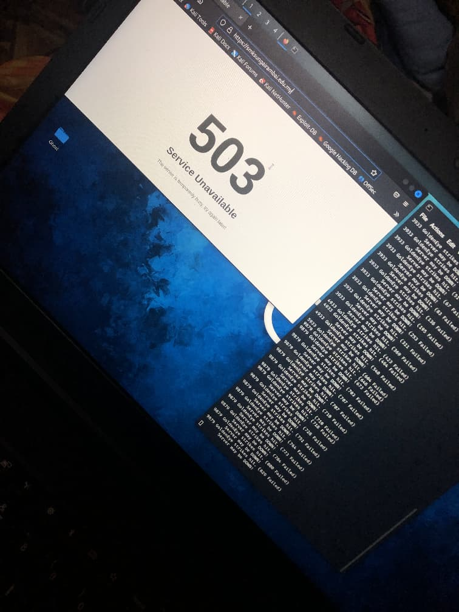

# ddos-attck-projek
This GoldenEye DDoS Testing project evaluates server resilience against Layer 7 attacks. Using a Python-based tool, it simulates high-volume traffic by leveraging HTTP Keep-Alive and No-Cache headers to exhaust server CPU/RAM. It aims to identify infrastructure breaking points and test the effectiveness of WAF/Rate Limiting.

## Hasil Ujian (Results)
Berikut adalah kesan serangan terhadap pelayan sasaran:

*Gambar: Pelayan memulangkan status 503 Service Unavailable selepas serangan dijalankan.*

## Legal & Ethical Notice
This project is intended strictly for security research and infrastructure resilience testing. The goal is to identify vulnerabilities to improve server defense mechanisms. Unauthorized access or attacks against systems without prior written consent is illegal.
